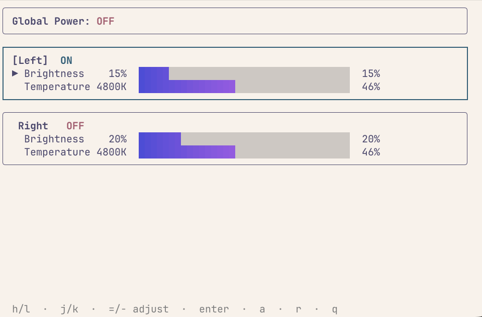

# keylightctl

Controls Elgato Key Light Air devices from the terminal: get status, turn lights
on and off, and set brightness and temperature, either with subcommands or in a
full-screen interactive TUI.

Lights are read from `~/.config/keylightctl/config.json` (respects `$XDG_CONFIG_HOME`; override with `-config`):

```json
{
  "lights": [
    { "name": "Left",  "ip": "192.168.2.164:9123" },
    { "name": "Right", "ip": "192.168.2.165:9123" }
  ]
}
```

```sh
keylightctl status           # show each light's status
keylightctl on               # turn on (-b brightness, -t temperature, -l light)
keylightctl off              # turn off (-l light)
keylightctl -version         # print version
```

Run `keylightctl` with no arguments for the interactive TUI:

| Key                  | Action                         |
| -------------------- | ------------------------------ |
| `h` / `l`            | Move between lights            |
| `j` / `k`            | Move between brightness / temp |
| `=` / `-`            | Adjust focused property        |
| `enter`              | Toggle the selected light      |
| `a`                  | Toggle all lights              |
| `r`                  | Refresh status                 |
| `q`, `esc`, `ctrl+c` | Quit                           |



Build and install with make:

```sh
make build        # ./bin/keylightctl
make install      # to ~/.local/bin (override with BINDIR=)
make uninstall    # remove from BINDIR
```
