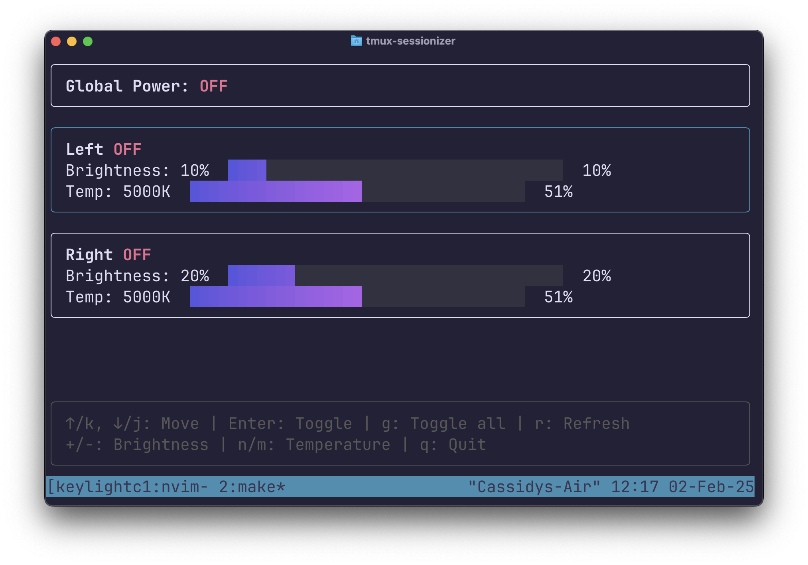

# keylightctl

`keylightctl` is a CLI tool for managing your Elgato Key Light Air. It allows you to control your lights directly from the terminal by configuring settings in a simple TOML file. With `keylightctl`, you can easily get the status, turn the lights on/off, and adjust brightness and temperature. **Additionally, it now features a full-screen interactive TUI mode for real-time control.**

## Features

- **Status:** View the current status of your Key Light Air.
- **Power Control:** Turn your light on or off.
- **Brightness Adjustment:** Set brightness to your desired level.
- **Temperature Control:** Adjust the color temperature.
- **Interactive TUI:** A full-screen, real-time control panel for managing your lights.

## Configuration

`keylightctl` uses a configuration file located at `$HOME/.keylightctl.toml`. Here’s an example configuration:

```toml
[[lights]]
name = "Left"
ip = "192.168.2.164:9123"

[[lights]]
name = "Right"
ip = "192.168.2.165:9123"
```

## Usage

### Commands

- **Get Status:**

  ```sh
  keylightctl status
  ```

- **Turn On:**

  ```sh
  keylightctl on
  ```

- **Turn Off:**

  ```sh
  keylightctl off
  ```

- **Help:**

  For a full list of commands and options:

  ```sh
  keylightctl --help
  ```

### TUI Mode

You can launch the interactive TUI mode by simply running `keylightctl` without any arguments:

```sh
keylightctl
```

#### TUI Controls

- **Navigation:** Use `↑/k` and `↓/j` to move between lights.
- **Toggle Light:** Press `Enter` to toggle the selected light on/off.
- **Global Toggle:** Press `g` to toggle all lights on/off.
- **Refresh Status:** Press `r` to refresh the light status.
- **Adjust Brightness:** Press `+` to increase or `-` to decrease brightness.
- **Adjust Temperature:** Press `n` to increase or `m` to decrease the temperature.
- **Quit:** Press `q`, `esc`, or `ctrl+c` to exit the TUI.

### Screenshot

Below is a screenshot of the TUI mode in action:


